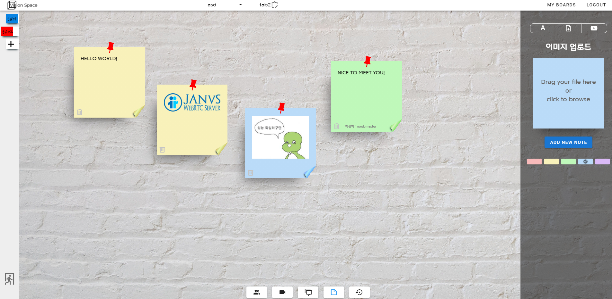

# 자율PJT - C102 - Vision Space


- 서비스 간략 소개: 노트를 붙여고 화상회의를 하며 아이디어를 만들어낼 수 있는 웹 서비스
- 배포 URL: https://k3c102.p.ssafy.io

- 구동 방법 (백엔드)

```
1. python -m venv venv로 가상 환경 생성
2. source venv/bin/activate (윈도우의 경우 venv/Scripts/activate)로 가상환경 진입
3. pip install -r requirements.txt를 통해 서버 환경 실행
4. python manage.py migrate
5. (배포) nohup python manage.py runserver 0:8080 & / (로컬) python manage.py runserver
```

- 구동 방법 (프론트)

```
1. Node.js 및 npm 설치
2. npm i
3. (개발자 모드) npm run serve / (빌드) npm run build
```

- 구동 방법 (Janus)

```
1. https://github.com/meetecho/janus-gateway의 가이드라인을 통해 서버 설치. 이때 make configs까지 꼭 완료해야 함.
2. 하단의 설정대로 config 파일을 수정할 것. CORS 설정 필수
3. 다음의 명령어를 통해 실행함.
4. /path/to/janus/janus --nat-1-1=(public ip) --stun-server=stun.l.google.com:19302
```

(janus.jcfg)

```
general: {
        configs_folder = "/opt/janus/etc/janus"                 # Configuration files folder
        plugins_folder = "/opt/janus/lib/janus/plugins"                 # Plugins folder
        transports_folder = "/opt/janus/lib/janus/transports"   # Transports folder
        events_folder = "/opt/janus/lib/janus/events"                   # Event handlers folder
        loggers_folder = "/opt/janus/lib/janus/loggers"                 # External loggers folder

        debug_level = 5                                                 # Debug/logging level, valid values are 0-7
        admin_secret = "janusoverlord"  # String that all Janus requests must contain
        protected_folders = [
                "/bin",
                "/boot",
                "/dev",
                "/etc",
                "/initrd",
                "/lib",
                "/lib32",
                "/lib64",
                "/proc",
                "/sbin",
                "/sys",
                "/usr",
                "/var",
                "/opt/janus/bin",
                "/opt/janus/etc",
                "/opt/janus/include",
                "/opt/janus/lib",
                "/opt/janus/lib32",
                "/opt/janus/lib64",
                "/opt/janus/sbin"
        ]
}

certificates: {
}

media: {

}

nat: {
        nice_debug = false
        ice_tcp = true
        ice_ignore_list = "vmnet"
        ignore_unreachable_ice_server = true
}

plugins: {
}

transports: {
}

loggers: {
}

events: {
}
```

(janus.transport.http.jcfg)

```
general: {
        json = "indented"                               # Whether the JSON messages should be indented (default),
        base_path = "/janus"                    # Base path to bind to in the web server (plain HTTP only)
        http = true                                             # Whether to enable the plain HTTP interface
        port = 8088                                             # Web server HTTP port
}

admin: {
        admin_base_path = "/admin"                      # Base path to bind to in the admin/monitor web server (plain HTTP only)
        admin_http = false                                       # Whether to enable the plain HTTP interface
        admin_port = 7088                                       # Admin/monitor web server HTTP port
}

cors: {
        allow_origin = ["(your front urls)"]	# THIS IS CRUCIAL!
}

certificates: {
}

```

- 구동 방법 (Node server)

```
1. Node.js 및 npm 설치
2. npm i
3. npm install forever -g
4. forever start server.js
```


- 기본 와이어 프레임


- 최종 서비스 화면

